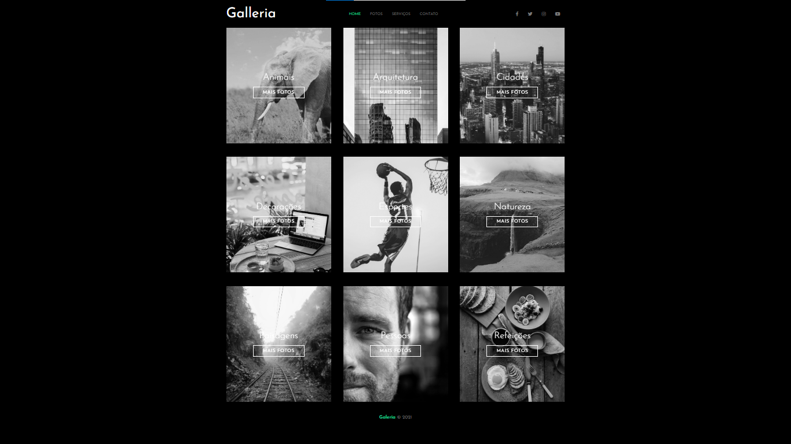

# Galleria SASS

Acesse o projeto clicando aqui: https://paulpessoa.github.io/galleria/

Sass (which stands for 'Syntactically awesome style sheets) is an extension of CSS that enables you to use things like variables, nested rules, inline imports and more. It also helps to keep things organised and allows you to create style sheets faster

Sass é uma linguagem de folhas de estilo concebida inicialmente por Hampton Catlin e desenvolvida por Natalie Weizenbaum. Depois de suas versões iniciais, Weizenbaum e Chris Eppstein continuaram a estender Sass com SassScript, uma simples linguagem de script usada em arquivos Sass.

https://fonts.google.com/specimen/Josefin+Sans?query=josefin+sa

https://cdnjs.com/libraries/font-awesome

https://sass-lang.com/install